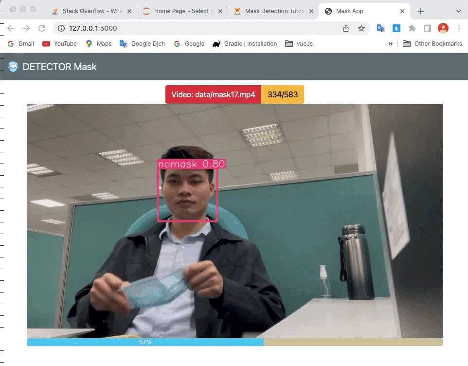
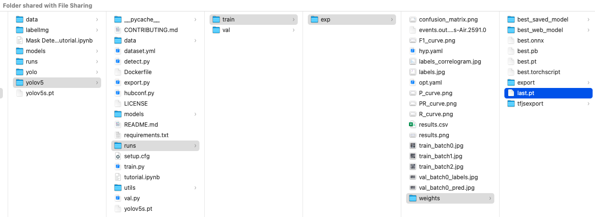
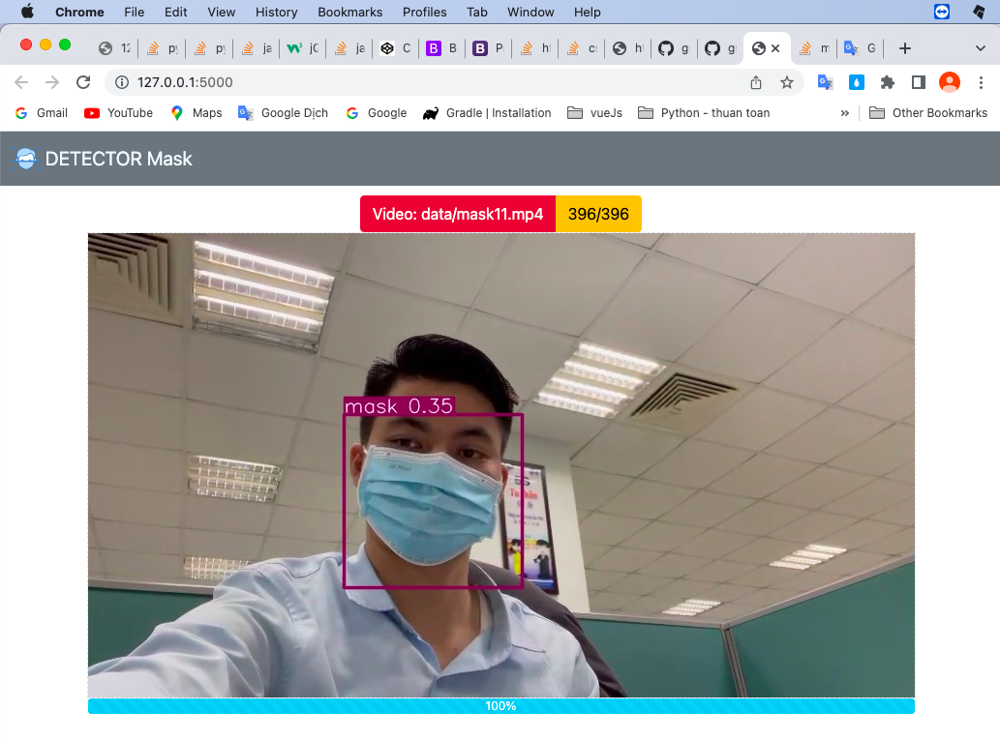

# Real-time object detection in web using YoloV5

This repository is part of the tutorial [Custom real-time object detection in the browser using yolov5](https://github.com/gshoanganh/mask-detection). **For a better understanding of how to create a custom object detection model, refer to the post**.


This project is a simple web-app that loads a model in yolov5 using Flask and performs real-time inferences ingesting videos from a PC or mobile camera.

A Mask detector was trained as a demo, it will produce results similar to the shown below:


<br/> 

## Getting started

- The first: `git clone https://github.com/gshoanganh/yolo-mask-detector.git`
- Then train your model.
- Here is my training model result: 

  

Tutorial for creating `your model`: [yolo-mask-detector](https://github.com/gshoanganh/yolo-mask-detector)
found: `your-project/yolov5/runs/train/exp/weights/last.pt`
You can train your own model, upload it in the `model` folder and load as well.
#### Creating web by Flask
The first, copy last.pt to `models/mask/last.pt` (create these folders yourself)
To make the model available, it is necessary to define how the model is going to be loaded in the function `load_model` (lines 10 in the file `your-project>video.py`). 
```
model = torch.hub.load('ultralytics/yolov5','custom', path='models/mask/last.pt',force_reload=True)
``` 
next, go to run your project (main.py)   
  

The application is going to run at `[http://127.0.0.1:5000](http://127.0.0.1:5000)` and you should see something similar to this:



The model takes from 1 to 2 seconds to load and, after that, you can show the objects images to the camera and the application is going to draw bounding boxes around them.

